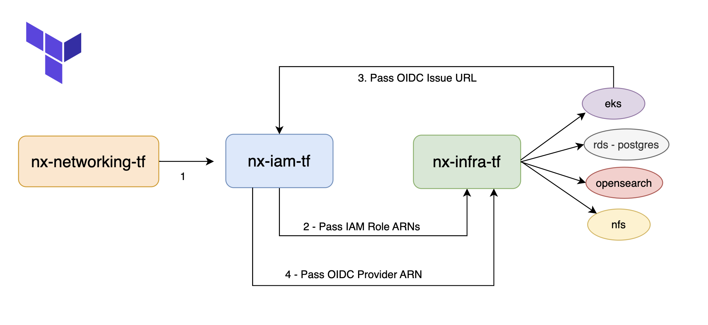

# nx-iam-tf

This Terraform module provisions IAM roles and policies required to support Amazon EKS clusters and managed node groups. It is derived and simplified from [terraform-aws-modules/terraform-aws-eks](https://github.com/terraform-aws-modules/terraform-aws-eks) version `v20.37.0`.

---

## Features

- IAM role for EKS cluster
- IAM roles for managed node groups
- OIDC provider support for IRSA (IAM Roles for Service Accounts)
- Cluster encryption IAM policy support
- Optional AWS Outpost configuration
- Support for IPv6 CNI IAM policy
- Full tagging support for IAM roles and policies

---

## Usage

```hcl
module "nx_iam" {
  source = "./nx-iam-tf"

  cluster_name             = "eks-nx"
  # Note: When enable_irsa = true, you must provide the oidc_issuer_url, which can be obtained from the output of the nx-infra-tf module.
  enable_irsa              = true
  oidc_issuer_url          = "https://oidc.eks.us-east-1.amazonaws.com/id/abc123"

  eks_managed_node_groups = {
    node_group_1 = {
        name = "eks-nx-1"
    }
    node_group_2 = {
        name = "eks-nx-2"
    }
  }
  region = "us-east-1"
}
```

## Usage Notes

To avoid dependency errors during the creation of the OIDC provider for IRSA, apply this module in two stages:



### Step 1 – Initial Apply (IRSA disabled)

```
enable_irsa     = false
oidc_issuer_url = ""

```
```
terraform apply
```
Then, supply the outputs from this module to the nx-infra-tf (infrastructure module) and apply it. After the infrastructure is created, extract the oidc_issuer_url from the outputs of nx-infra-tf.

### Step 2 – Final Apply (IRSA enabled)

Set the correct OIDC issuer URL:

```
enable_irsa     = true
oidc_issuer_url = "<output oidc_provider_url of module nx-infra-tf>"

```
```
terraform apply
```


## Requirements

No requirements.

## Providers

| Name | Version |
|------|---------|
| <a name="provider_aws"></a> [aws](#provider\_aws) | n/a |
| <a name="provider_tls"></a> [tls](#provider\_tls) | n/a |

## Modules

| Name | Source | Version |
|------|--------|---------|
| <a name="module_eks_managed_node_group"></a> [eks\_managed\_node\_group](#module\_eks\_managed\_node\_group) | ./modules/eks-managed-node-group | n/a |

## Resources

| Name | Type |
|------|------|
| [aws_iam_openid_connect_provider.oidc_provider](https://registry.terraform.io/providers/hashicorp/aws/latest/docs/resources/iam_openid_connect_provider) | resource |
| [aws_iam_policy.cluster_encryption](https://registry.terraform.io/providers/hashicorp/aws/latest/docs/resources/iam_policy) | resource |
| [aws_iam_policy.custom](https://registry.terraform.io/providers/hashicorp/aws/latest/docs/resources/iam_policy) | resource |
| [aws_iam_role.eks_auto](https://registry.terraform.io/providers/hashicorp/aws/latest/docs/resources/iam_role) | resource |
| [aws_iam_role.this](https://registry.terraform.io/providers/hashicorp/aws/latest/docs/resources/iam_role) | resource |
| [aws_iam_role_policy_attachment.additional](https://registry.terraform.io/providers/hashicorp/aws/latest/docs/resources/iam_role_policy_attachment) | resource |
| [aws_iam_role_policy_attachment.cluster_encryption](https://registry.terraform.io/providers/hashicorp/aws/latest/docs/resources/iam_role_policy_attachment) | resource |
| [aws_iam_role_policy_attachment.custom](https://registry.terraform.io/providers/hashicorp/aws/latest/docs/resources/iam_role_policy_attachment) | resource |
| [aws_iam_role_policy_attachment.eks_auto](https://registry.terraform.io/providers/hashicorp/aws/latest/docs/resources/iam_role_policy_attachment) | resource |
| [aws_iam_role_policy_attachment.eks_auto_additional](https://registry.terraform.io/providers/hashicorp/aws/latest/docs/resources/iam_role_policy_attachment) | resource |
| [aws_iam_role_policy_attachment.this](https://registry.terraform.io/providers/hashicorp/aws/latest/docs/resources/iam_role_policy_attachment) | resource |
| [aws_caller_identity.current](https://registry.terraform.io/providers/hashicorp/aws/latest/docs/data-sources/caller_identity) | data source |
| [aws_iam_policy_document.assume_role_policy](https://registry.terraform.io/providers/hashicorp/aws/latest/docs/data-sources/iam_policy_document) | data source |
| [aws_iam_policy_document.custom](https://registry.terraform.io/providers/hashicorp/aws/latest/docs/data-sources/iam_policy_document) | data source |
| [aws_iam_policy_document.node_assume_role_policy](https://registry.terraform.io/providers/hashicorp/aws/latest/docs/data-sources/iam_policy_document) | data source |
| [aws_partition.current](https://registry.terraform.io/providers/hashicorp/aws/latest/docs/data-sources/partition) | data source |
| [tls_certificate.this](https://registry.terraform.io/providers/hashicorp/tls/latest/docs/data-sources/certificate) | data source |

## Inputs

| Name | Description | Type | Default | Required |
|------|-------------|------|---------|:--------:|
| <a name="input_attach_cluster_encryption_policy"></a> [attach\_cluster\_encryption\_policy](#input\_attach\_cluster\_encryption\_policy) | Indicates whether or not to attach an additional policy for the cluster IAM role to utilize the encryption key provided | `bool` | `true` | no |
| <a name="input_cluster_compute_config"></a> [cluster\_compute\_config](#input\_cluster\_compute\_config) | Configuration block for the cluster compute configuration | `any` | `{}` | no |
| <a name="input_cluster_encryption_config"></a> [cluster\_encryption\_config](#input\_cluster\_encryption\_config) | Configuration block with encryption configuration for the cluster. To disable secret encryption, set this value to `{}` | `any` | <pre>{<br/>  "resources": [<br/>    "secrets"<br/>  ]<br/>}</pre> | no |
| <a name="input_cluster_encryption_policy_description"></a> [cluster\_encryption\_policy\_description](#input\_cluster\_encryption\_policy\_description) | Description of the cluster encryption policy created | `string` | `"Cluster encryption policy to allow cluster role to utilize CMK provided"` | no |
| <a name="input_cluster_encryption_policy_name"></a> [cluster\_encryption\_policy\_name](#input\_cluster\_encryption\_policy\_name) | Name to use on cluster encryption policy created | `string` | `null` | no |
| <a name="input_cluster_encryption_policy_path"></a> [cluster\_encryption\_policy\_path](#input\_cluster\_encryption\_policy\_path) | Cluster encryption policy path | `string` | `null` | no |
| <a name="input_cluster_encryption_policy_tags"></a> [cluster\_encryption\_policy\_tags](#input\_cluster\_encryption\_policy\_tags) | A map of additional tags to add to the cluster encryption policy created | `map(string)` | `{}` | no |
| <a name="input_cluster_encryption_policy_use_name_prefix"></a> [cluster\_encryption\_policy\_use\_name\_prefix](#input\_cluster\_encryption\_policy\_use\_name\_prefix) | Determines whether cluster encryption policy name (`cluster_encryption_policy_name`) is used as a prefix | `bool` | `true` | no |
| <a name="input_cluster_name"></a> [cluster\_name](#input\_cluster\_name) | Name of the EKS cluster | `string` | `""` | no |
| <a name="input_create"></a> [create](#input\_create) | Determines whether to create EKS managed node group or not | `bool` | `true` | no |
| <a name="input_create_cni_ipv6_iam_policy"></a> [create\_cni\_ipv6\_iam\_policy](#input\_create\_cni\_ipv6\_iam\_policy) | Determines whether to create an [`AmazonEKS_CNI_IPv6_Policy`](https://docs.aws.amazon.com/eks/latest/userguide/cni-iam-role.html#cni-iam-role-create-ipv6-policy) | `bool` | `false` | no |
| <a name="input_create_iam_role"></a> [create\_iam\_role](#input\_create\_iam\_role) | Determines whether an IAM role is created for the cluster | `bool` | `true` | no |
| <a name="input_create_node_iam_role"></a> [create\_node\_iam\_role](#input\_create\_node\_iam\_role) | Determines whether an EKS Auto node IAM role is created | `bool` | `true` | no |
| <a name="input_custom_oidc_thumbprints"></a> [custom\_oidc\_thumbprints](#input\_custom\_oidc\_thumbprints) | Additional list of server certificate thumbprints for the OpenID Connect (OIDC) identity provider's server certificate(s) | `list(string)` | `[]` | no |
| <a name="input_dataplane_wait_duration"></a> [dataplane\_wait\_duration](#input\_dataplane\_wait\_duration) | Duration to wait after the EKS cluster has become active before creating the dataplane components (EKS managed node group(s), self-managed node group(s), Fargate profile(s)) | `string` | `"30s"` | no |
| <a name="input_eks_managed_node_group_defaults"></a> [eks\_managed\_node\_group\_defaults](#input\_eks\_managed\_node\_group\_defaults) | Map of EKS managed node group default configurations | `any` | `{}` | no |
| <a name="input_eks_managed_node_groups"></a> [eks\_managed\_node\_groups](#input\_eks\_managed\_node\_groups) | Map of EKS managed node group definitions to create | `any` | `{}` | no |
| <a name="input_enable_auto_mode_custom_tags"></a> [enable\_auto\_mode\_custom\_tags](#input\_enable\_auto\_mode\_custom\_tags) | Determines whether to enable permissions for custom tags resources created by EKS Auto Mode | `bool` | `true` | no |
| <a name="input_enable_irsa"></a> [enable\_irsa](#input\_enable\_irsa) | Determines whether to create an OpenID Connect Provider for EKS to enable IRSA | `bool` | `true` | no |
| <a name="input_enable_security_groups_for_pods"></a> [enable\_security\_groups\_for\_pods](#input\_enable\_security\_groups\_for\_pods) | Determines whether to add the necessary IAM permission policy for security groups for pods | `bool` | `true` | no |
| <a name="input_iam_role_additional_policies"></a> [iam\_role\_additional\_policies](#input\_iam\_role\_additional\_policies) | Additional policies to be added to the IAM role | `map(string)` | `{}` | no |
| <a name="input_iam_role_arn"></a> [iam\_role\_arn](#input\_iam\_role\_arn) | Existing IAM role ARN for the cluster. Required if `create_iam_role` is set to `false` | `string` | `null` | no |
| <a name="input_iam_role_description"></a> [iam\_role\_description](#input\_iam\_role\_description) | Description of the role | `string` | `null` | no |
| <a name="input_iam_role_name"></a> [iam\_role\_name](#input\_iam\_role\_name) | Name to use on IAM role created | `string` | `null` | no |
| <a name="input_iam_role_path"></a> [iam\_role\_path](#input\_iam\_role\_path) | The IAM role path | `string` | `null` | no |
| <a name="input_iam_role_permissions_boundary"></a> [iam\_role\_permissions\_boundary](#input\_iam\_role\_permissions\_boundary) | ARN of the policy that is used to set the permissions boundary for the IAM role | `string` | `null` | no |
| <a name="input_iam_role_tags"></a> [iam\_role\_tags](#input\_iam\_role\_tags) | A map of additional tags to add to the IAM role created | `map(string)` | `{}` | no |
| <a name="input_iam_role_use_name_prefix"></a> [iam\_role\_use\_name\_prefix](#input\_iam\_role\_use\_name\_prefix) | Determines whether the IAM role name (`iam_role_name`) is used as a prefix | `bool` | `true` | no |
| <a name="input_include_oidc_root_ca_thumbprint"></a> [include\_oidc\_root\_ca\_thumbprint](#input\_include\_oidc\_root\_ca\_thumbprint) | Determines whether to include the root CA thumbprint in the OpenID Connect (OIDC) identity provider's server certificate(s) | `bool` | `true` | no |
| <a name="input_node_iam_role_additional_policies"></a> [node\_iam\_role\_additional\_policies](#input\_node\_iam\_role\_additional\_policies) | Additional policies to be added to the EKS Auto node IAM role | `map(string)` | `{}` | no |
| <a name="input_node_iam_role_description"></a> [node\_iam\_role\_description](#input\_node\_iam\_role\_description) | Description of the EKS Auto node IAM role | `string` | `null` | no |
| <a name="input_node_iam_role_name"></a> [node\_iam\_role\_name](#input\_node\_iam\_role\_name) | Name to use on the EKS Auto node IAM role created | `string` | `null` | no |
| <a name="input_node_iam_role_path"></a> [node\_iam\_role\_path](#input\_node\_iam\_role\_path) | The EKS Auto node IAM role path | `string` | `null` | no |
| <a name="input_node_iam_role_permissions_boundary"></a> [node\_iam\_role\_permissions\_boundary](#input\_node\_iam\_role\_permissions\_boundary) | ARN of the policy that is used to set the permissions boundary for the EKS Auto node IAM role | `string` | `null` | no |
| <a name="input_node_iam_role_tags"></a> [node\_iam\_role\_tags](#input\_node\_iam\_role\_tags) | A map of additional tags to add to the EKS Auto node IAM role created | `map(string)` | `{}` | no |
| <a name="input_node_iam_role_use_name_prefix"></a> [node\_iam\_role\_use\_name\_prefix](#input\_node\_iam\_role\_use\_name\_prefix) | Determines whether the EKS Auto node IAM role name (`node_iam_role_name`) is used as a prefix | `bool` | `true` | no |
| <a name="input_oidc_issuer_url"></a> [oidc\_issuer\_url](#input\_oidc\_issuer\_url) | OIDC issuer URL from the EKS cluster | `string` | `""` | no |
| <a name="input_openid_connect_audiences"></a> [openid\_connect\_audiences](#input\_openid\_connect\_audiences) | List of OpenID Connect audience client IDs to add to the IRSA provider | `list(string)` | `[]` | no |
| <a name="input_outpost_config"></a> [outpost\_config](#input\_outpost\_config) | Configuration for the AWS Outpost to provision the cluster on | `any` | `{}` | no |
| <a name="input_prefix_separator"></a> [prefix\_separator](#input\_prefix\_separator) | The separator to use between the prefix and the generated timestamp for resource names | `string` | `"-"` | no |
| <a name="input_tags"></a> [tags](#input\_tags) | A map of tags to add to all resources | `map(string)` | `{}` | no |

## Outputs

| Name | Description |
|------|-------------|
| <a name="output_eks_auto_node_iam_role_arn"></a> [eks\_auto\_node\_iam\_role\_arn](#output\_eks\_auto\_node\_iam\_role\_arn) | IAM Role ARN used by EKS Auto Node Group |
| <a name="output_eks_cluster_iam_role_arn"></a> [eks\_cluster\_iam\_role\_arn](#output\_eks\_cluster\_iam\_role\_arn) | IAM Role ARN used by EKS cluster |
| <a name="output_eks_managed_node_group_iam_role_arns"></a> [eks\_managed\_node\_group\_iam\_role\_arns](#output\_eks\_managed\_node\_group\_iam\_role\_arns) | IAM Role ARNs for all EKS managed node groups |
| <a name="output_oidc_provider_arn"></a> [oidc\_provider\_arn](#output\_oidc\_provider\_arn) | The ARN of the OIDC Provider if `enable_irsa = true` |
